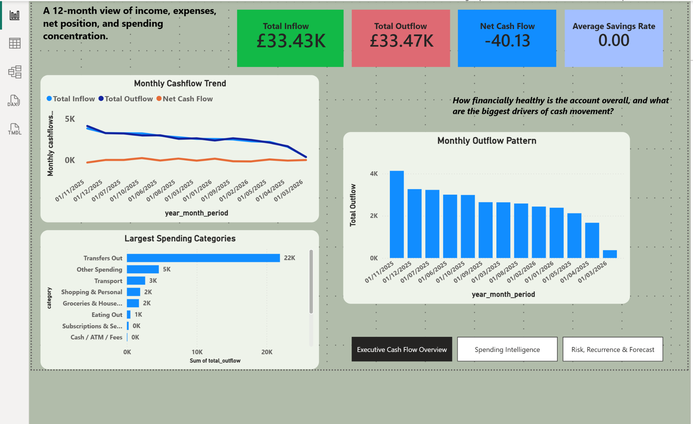
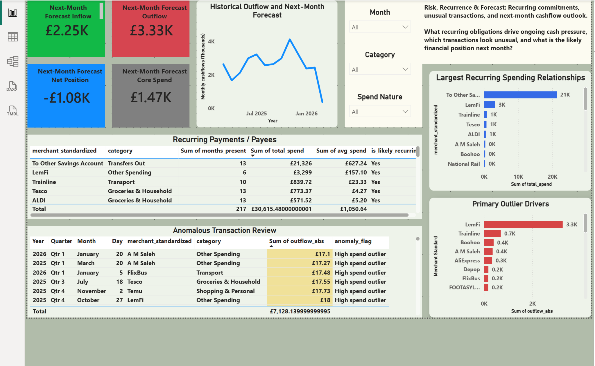
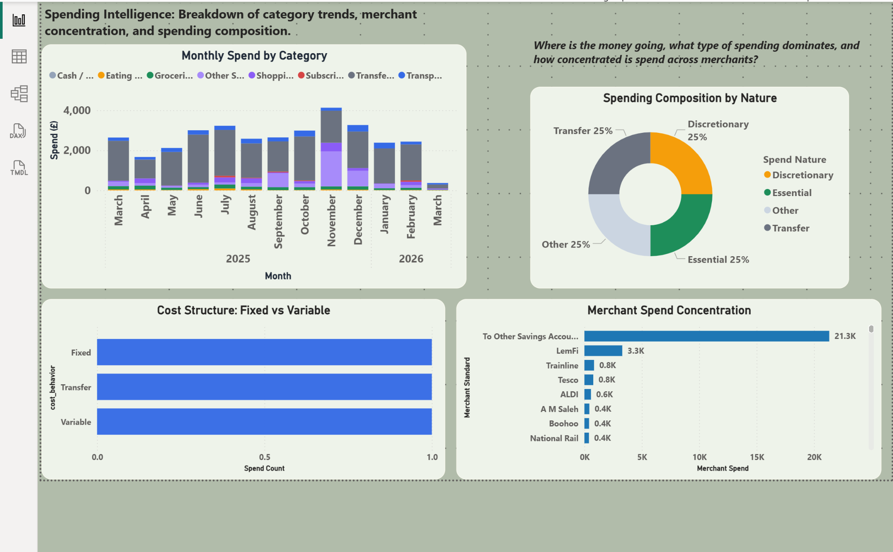

# Personal Cash Flow Intelligence Dashboard

A 12-month analytics case study that transforms raw bank statement transactions into a decision-ready financial intelligence dashboard using Python and Power BI.

This project started as a practical finance question and became a full end-to-end analytics product: raw CSV ingestion, data cleaning, feature engineering, transaction categorisation, recurring-payment analysis, anomaly detection, forecasting, DAX modelling, and executive dashboard storytelling.

# Summary
This project was designed to go beyond simple budgeting. The aim was to treat personal financial data the way a Senior Data Analyst would treat business data: clean it properly, structure it thoughtfully, analyse it deeply, and present it in a way that supports decisions.

The final solution combines:

Python for data preparation, classification logic, anomaly detection, and forecasting
Power BI for KPI design, DAX modelling, interactive filtering, and executive storytelling

The dashboard was built around three business questions:

1. **How healthy is overall cash flow?**
2. **Where is money going, and what type of spending dominates?**
3. **What recurring commitments, unusual transactions, and short-term forecast signals deserve attention?**

This makes the project stronger than a budgeting exercise. It demonstrates real analytical capability across the full cycle: data cleaning, feature engineering, segmentation, KPI design, anomaly detection, forecasting, DAX, and dashboard communication.

# Business Objective

The goal of the project was to turn raw bank statement data into a recruiter-ready decision dashboard that could answer:

- What is the overall inflow, outflow, and net cash position across the 12-month period?
- How does spending change month by month?
- Which spending categories and merchants dominate the account?
- Which payments appear repeatedly and behave like recurring commitments?
- Which transactions are unusually large or inconsistent with normal behaviour?
- What is the expected next-month cash position based on historical patterns?

From a portfolio perspective, the bigger objective was to show the ability to move from **raw transactional data** to **executive reporting**.

## Dataset
Source: CSV account statement export with transaction-level records.
Key fields included:
- transaction type
- started date
- completed date
- description
- amount
- fee
- currency
- state
- balance

At first glance, the file looked structured. In practice, it still required cleaning, standardisation, feature engineering, and business logic before it was reliable enough for dashboarding.

## Project Architecture
### Python layer
Used for:
- reading and auditing the raw CSV
- data cleaning and type conversion
- filtering to valid completed transactions
- feature engineering
- rule-based categorisation
- monthly aggregation
- recurring payment logic
- anomaly detection
- one-month forecasting
- exporting analysis-ready tables

### Power BI layer
Used for:

- model setup
- DAX measures
- KPI cards
- interactive filtering
- visual storytelling
- executive dashboard design

That split was intentional: Python handled the heavy analytical preparation, while Power BI handled presentation and business interaction.

## Data Cleaning in Python
This is where the credibility of the analysis was built.
### 1. Load and inspect the raw file
The CSV was loaded into pandas and checked for:

- dataset shape
- column names
- missing values
- data types
- duplicates
- sample rows

**Why it mattered:** without understanding the raw structure first, it is easy to group by the wrong date, sum text fields, or build charts on bad assumptions.

### 2. Convert date fields properly
`Started Date` and `Completed Date` were converted into true datetime fields.

**Why it mattered:** text dates break sorting, monthly grouping, time-series analysis, and forecasting.

### 3. Create one analysis date
A single `analysis_date` was created using:

- `Completed Date` first
- `Started Date` as fallback

**Why it mattered:** for financial reporting, completed date is usually the best representation of when money truly settled.
### 4. Keep only completed transactions
Only rows with `State = COMPLETED` were retained.

**Why it mattered:** pending, cancelled, or reversed activity can distort actual cash movement.

### 5. Convert numeric columns
The following were converted to numeric types:

- `Amount`
- `Fee`
- `Balance`

**Why it mattered:** financial KPIs and charts depend on reliable numeric columns.

### 6. Remove duplicates
Duplicate rows were checked and dropped.

**Why it mattered:** duplicates can inflate totals and distort recurring-payment or anomaly logic.

### 7. Engineer time features
Helper fields were added for:

- year
- month number
- month name
- year-month
- quarter
- day of week
- day of month
- weekend flag

**Why it mattered:** these fields make trend analysis, behavioural slicing, and dashboard filtering much easier.

### 8. Separate inflow and outflow
The signed amount was split into:

- `inflow_abs`
- `outflow_abs`

A `flow_direction` label was also added.

**Why it mattered:** it is much easier to calculate inflow, outflow, net position, merchant spend, and category spend when cash movement is separated clearly.

### 9. Clean descriptions
Transaction descriptions were standardised by cleaning whitespace and normalising merchant text.

**Why it mattered:** the same merchant can appear under slightly different spellings or spacing, which breaks grouping and recurring analysis.

### 10. Build the category engine
A rule-based categorisation function was created using transaction descriptions and transaction type.

Example output categories:

- Transport
- Groceries & Household
- Eating Out
- Shopping & Personal
- Subscriptions & Services
- Transfers Out
- Cash / ATM / Fees
- Other Spending
- Income / Topups
- Refunds

**Why it mattered:** raw merchant-level data is too granular to tell a strategic story on its own.

### 11. Add higher-level labels
Additional labels were created to support richer analysis:

- Essential
- Discretionary
- Transfer
- Other
- Fixed
- Variable

**Why it mattered:** this made the dashboard more decision-oriented by showing spend quality, not just spend quantity.

### 12. Export analysis-ready tables
The Python workflow produced clean outputs for Power BI, including:

- cleaned transactions
- monthly cash flow
- category summary
- category monthly trend
- merchant summary
- recurring payments
- anomalies
- spend nature summary
- cost behavior summary
- forecast tables
- KPI table

**Why it mattered:** Power BI works best with tidy, purpose-built tables rather than one overloaded raw file.
## Analysis Performed
### Monthly cash flow analysis
Built monthly KPIs for:

- inflow
- outflow
- net cash flow
- fees
- ending balance
- rolling averages
- savings rate
- expense-to-income ratio

This became the backbone of the **Executive Cash Flow Overview** page.

### Spending segmentation
Spend was segmented by:

- category
- merchant
- spend nature
- cost behaviour
- month

This supported the **Spending Intelligence** page.

### Recurring payment analysis
Merchants were grouped and checked for repeated appearances across distinct months.

**Why it mattered:** recurring costs often shape financial pressure more than one-off spikes.

### Anomaly detection
Outliers were flagged on non-transfer outflows using the IQR method:

- Q1
- Q3
- IQR = Q3 - Q1
- threshold = Q3 + 1.5 × IQR

**Why it mattered:** this moved the project beyond basic BI reporting into genuine analytical problem-finding.

### Forecasting
Exponential Smoothing was used on complete monthly history to estimate:

- next-month inflow
- next-month outflow
- next-month net position
- next-month core outflow excluding transfers

**Why it mattered:** this introduced a predictive layer, which makes the project much stronger for a portfolio.
## Key Challenges and How They Were Handled

### Date ambiguity
The data contained both started and completed dates.

**Resolution:** a single `analysis_date` was created using completed date first and started date as fallback.

### Text-based month sorting in Power BI
Month fields like `2025-03` can sort badly when treated as plain text.

**Resolution:** a numeric month sort key was created and used to sort the display month.

### Inconsistent merchant descriptions
Slight text variation caused merchant fragmentation.

**Resolution:** merchant descriptions were cleaned and standardised before grouping.

### Transfer-heavy outflows distorting spend analysis
Transfers can overwhelm lifestyle categories and hide real spending behaviour.

**Resolution:** transfers were explicitly categorised and core spend was analysed separately from transfer-heavy outflow.

### Summary tables and filtering limitations in Power BI
Slicers do not automatically filter every visual if summary tables are not related properly.

**Resolution:** shared fields were used where possible, and relationships were handled deliberately. This was treated as a real BI modelling challenge, not a mistake.

### DAX context and aggregation issues
Measures can behave differently depending on slicers, cross-highlighting, and whether averages are defined as row-level, month-level, or ratio-of-total logic.

**Resolution:** measures were kept simple, explicit, and aligned to business meaning.

### Long visual titles and constrained space
Some titles were clipped during dashboard design.

**Resolution:** visuals were resized and titles rewritten in shorter, stronger language.

### Balancing analytical depth with executive readability
There is always tension between showing detail and keeping the report clean.

**Resolution:** the report was split into three focused pages with a clear storytelling flow.

## Power BI Dashboard Design Rationale
The dashboard was split into three pages deliberately.

### Page 1 — Executive Cash Flow Overview
**Purpose:** give a fast executive summary of cash flow health.

It answers:
- how much came in
- how much went out
- what the net position was
- what categories dominated spend

### Page 2 — Spending Intelligence
**Purpose:** explain where the money goes and what type of spending dominates.

It answers:
- how category composition changes over time
- whether spending is essential or discretionary
- whether costs are fixed or variable
- which merchants dominate spend

### Page 3 — Risk, Recurrence & Forecast Outlook
**Purpose:** identify risk and support forward-looking decisions.

It answers:
- what recurring costs exist
- which transactions look unusual
- what next month may look like

This final page is what elevates the project from simple reporting into decision support.
## Dashboard Screenshots
### Page 1 — Executive Cash Flow Overview


### Page 2 — Spending Intelligence


### Page 3 — Risk, Recurrence & Forecast Outlook


## Why This Project Is Strong for Recruiters
This project shows more than tool usage. It demonstrates:

- real-world data cleaning
- structured analytical thinking
- feature engineering
- financial KPI design
- segmentation logic
- anomaly detection
- forecasting
- DAX fluency
- dashboard communication

In short, it shows the ability to do the full analytics job, not just build charts.

---

## Tools Used

- Python
- pandas
- NumPy
- statsmodels
- Power BI
- DAX
- CSV / Excel workflow

## How to Run the Python Workflow

1. Place the raw account statement CSV in your working directory.
2. Open `cashflow_diy_pipeline.py`.
3. Update the `INPUT_FILE` path if needed.
4. Run the script.
5. Load the exported CSV outputs into Power BI.

Example:

```bash
python cashflow_diy_pipeline.py
```

What makes this project meaningful is not that it uses personal finance data. What makes it meaningful is that it treats messy transaction data as a real analytics problem: one that requires careful cleaning, clear business framing, thoughtful modelling, and decision-ready communication.
